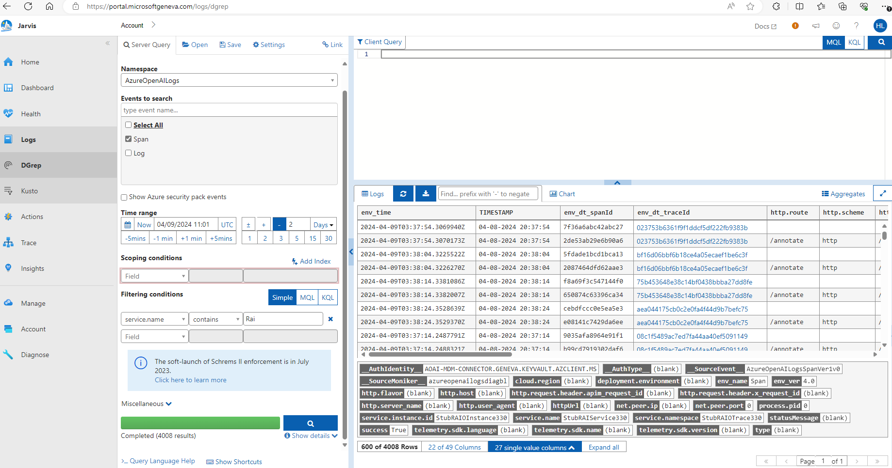
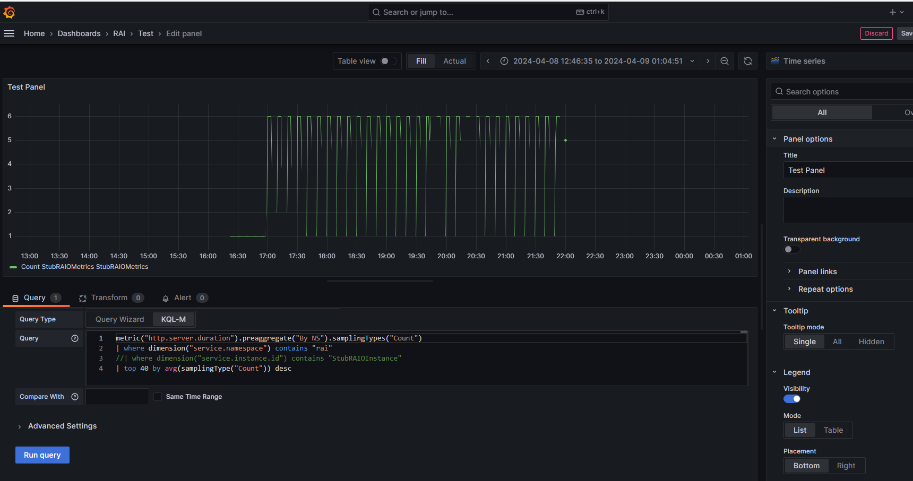

# RAIO Open Telemetry Experiment Repo
This repo has several stub services for Open Telemetry/RAIO integration experiment

# Content
- OtelClient: A go client that makes http request with open telemetry instrumented http client. A OTLP export is configured to export the open telemetry data.
- OtelServer: A go instrumented http server that receives http request. A OTLP export is configured to export the open telemetry data.
- OtelClient-python: A python client that makes http request with open telemetry instrumented http client.

# Verify OpenTelemetry Exporter/Collector flow locally.

## Start the Open Telemetry OTLP Collector
Start a local open telemetry collector. The */home/huliang/testdata/yamls/otel/config.debug.yaml* is the yaml with debug setting. The file can be found [here](config.debug.yaml)
````
sudo docker run -it -p 4317:4317 -p 4318:4318 -v /home/huliang/testdata/yamls/otel/config.debug.yaml:/etc/otelcol-contrib/config.yaml otel/opentelemetry-collector-contrib:0.93.0
````

Export OTEL_EXPORTER_OTLP_ENDPOINT environment variable, this is necessary because OpenTelemetry SDK is using https://localhost:4318 by default.
````
export OTEL_EXPORTER_OTLP_ENDPOINT=http://localhost:4318
````

## Start the stub client and service with Open Telemetry instrumentation.

Run the stub service, it will listen ```http://localhost:12345```
````
cd <repo root>
cd go-otel/otelserver/
go run .
````

Run the stub client, it will try to call ```http://localhost:12345/annotate``` on a fixed internal.
````
cd <repo root>
cd go-otel/otelclient/
go run .
````

Once the client and service are started and the Otel collector is running, the metrics and logs will be sent to Otel collector and. You should be able to see them in the console output from the Otel collector.

Sample output:
```
Metric #2
Descriptor:
     -> Name: http.server.duration
     -> Description: Measures the duration of HTTP request handling
     -> Unit: ms
     -> DataType: Histogram
     -> AggregationTemporality: Delta
HistogramDataPoints #0
Data point attributes:
     -> http.method: Str(GET)
     -> http.route: Str(/annotate)
     -> http.scheme: Str(http)
     -> http.status_code: Int(200)
     -> net.host.name: Str(localhost)
     -> net.host.port: Int(12345)
     -> net.protocol.name: Str(http)
     -> net.protocol.version: Str(1.1)
StartTimestamp: 2024-04-08 20:39:19.9397612 +0000 UTC
Timestamp: 2024-04-08 20:39:22.9388652 +0000 UTC
Count: 1
```


# Verify OpenTelemetry Exporter/Collector flow with remote public collector in Azure.
Export this necessary enviroinment variables.
OTEL_EXPORTER_OTLP_METRICS_TEMPORALITY_PREFERENCE is setting the Temporality for metrics/logs emitting. It is fine to not set this if we are just testing with local collector but the public Open Telemetry collector that the AOAI agent team provides can only accept "Delta"
````
export OTEL_EXPORTER_OTLP_ENDPOINT=https://ca-otelcol-lgvgvhiuark32.nicefield-824a522d.westus3.azurecontainerapps.io
export OTEL_EXPORTER_OTLP_METRICS_TEMPORALITY_PREFERENCE=Delta
export AZURE_TENANT_ID="33e01921-4d64-4f8c-a055-5bdaffd5e33d"  // Not really need if you run the stub service, it is hard coded already.
export AZURE_CLIENT_ID="9c7ae59d-9323-4423-a0da-38ddce774875"   // Not really need if you run the stub service, it is hard coded already.
export AZURE_CLIENT_SECRET="CANNOTSHOW"
````
Start the client and server as above section.

# Build the Otel Stub server docker container.
A Dockerfile is in the same directory. The command to build the docker image is:
````
go build -o otelserver .
docker build -t otel-server-container .
docker run -p 12345:12345 ootel-server-container
````

# Check logs in Dgrep
[Dgrep](https://portal.microsoftgeneva.com/logs/dgrep)
Namespace: ```AzureOpenAILogs```
Events to search: click ```Span``` and ```Log```
In the Filtering conditions, set ```service.name contains Rai```


# Check metrics in Grafana
[Grafana](https://aoai-assistants-monitor-efhxgndbcdftd3gh.eus.grafana.azure.com/d/e2595cf6-d957-4281-97cd-02d984b0f646/test?orgId=1&from=now-3h&to=now)
Sample query:
```
metric("http.server.duration").preaggregate("By NS").samplingTypes("Count")
| where dimension("service.namespace") contains "rai"
//| where dimension("service.instance.id") contains "StubRAIOInstance"
| top 40 by avg(samplingType("Count")) desc
```


Modify the metrics pre aggregation [here](https://portal.microsoftgeneva.com/manage/metrics/v1?account=AzureOpenAIMetrics&namespace=PlatformMetrics&metric=annotate&tab=metrics&hideLeftNav=true&newManageSessionId=ee2ed0b5-ac2a-496e-a4d3-8e369583f9ac)